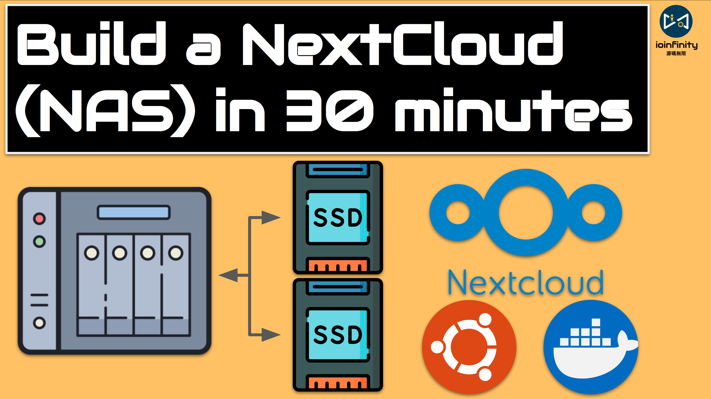
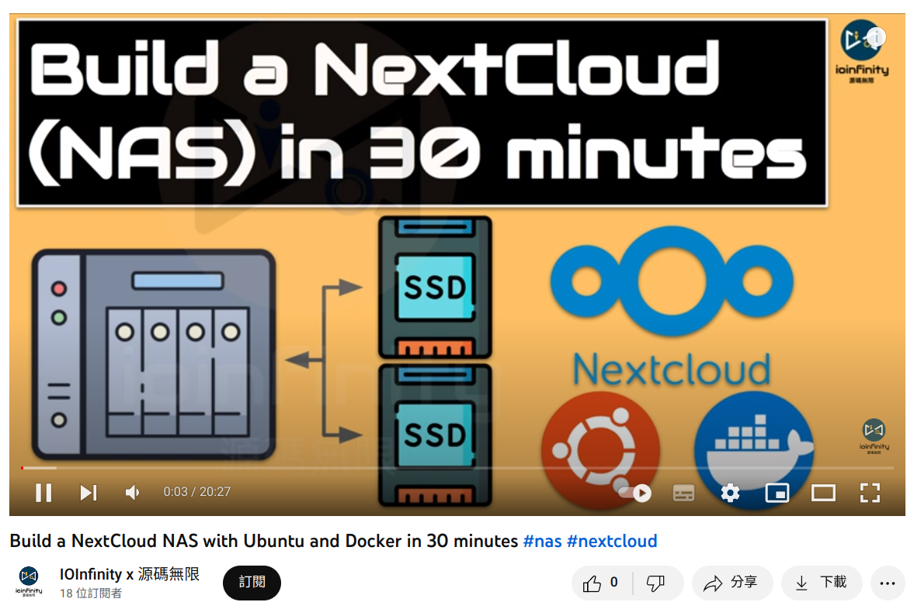

# NextCloudNAS 

*IOInfinity x 源碼無限*

Try to build NextCloud NAS with Docker container.

## Video about Installing step by step

https://www.youtube.com/watch?v=8uNCjq58X5E

## How to build NextCloud service

1. Install Docker in your device
Mac    : https://docs.docker.com/desktop/install/mac-install/
Ubuntu : https://docs.docker.com/engine/install/ubuntu/
Windows: https://docs.docker.com/desktop/install/windows-install/

2. Download this repository to your device
Git Method       :   $ git clone https://github.com/IOInfinityStudio/NextCloudNAS.git
Download Directly:   https://github.com/IOInfinityStudio/NextCloudNAS/archive/refs/heads/main.zip

3. Modify the .env for DB configuration and Nextcloud's folder and port

4. sudo docker-compose up 

5. http://localhost:{your port} e.g. http://localhost:8080
